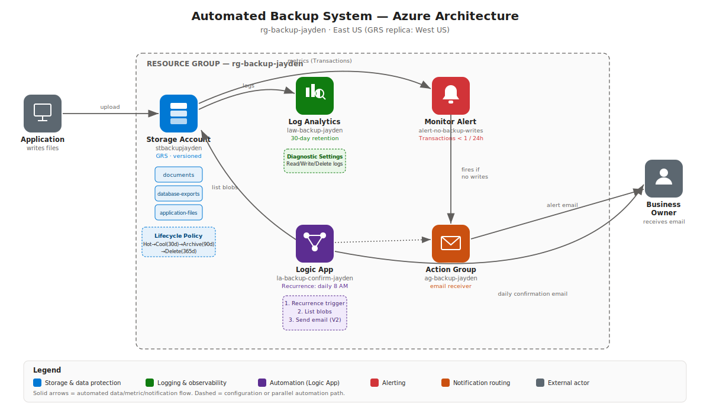
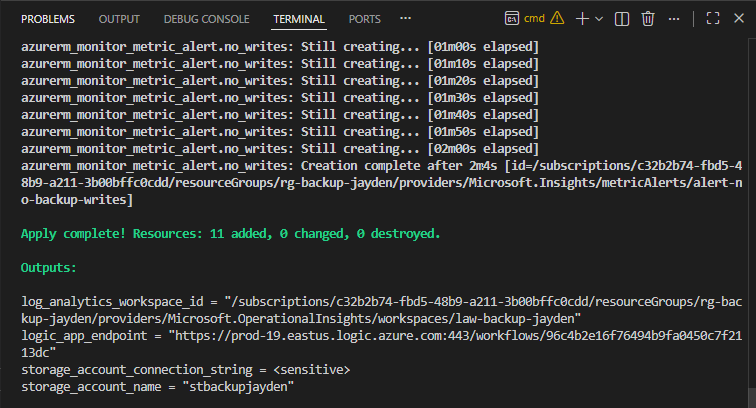
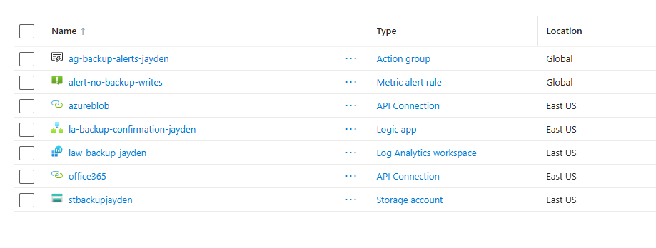
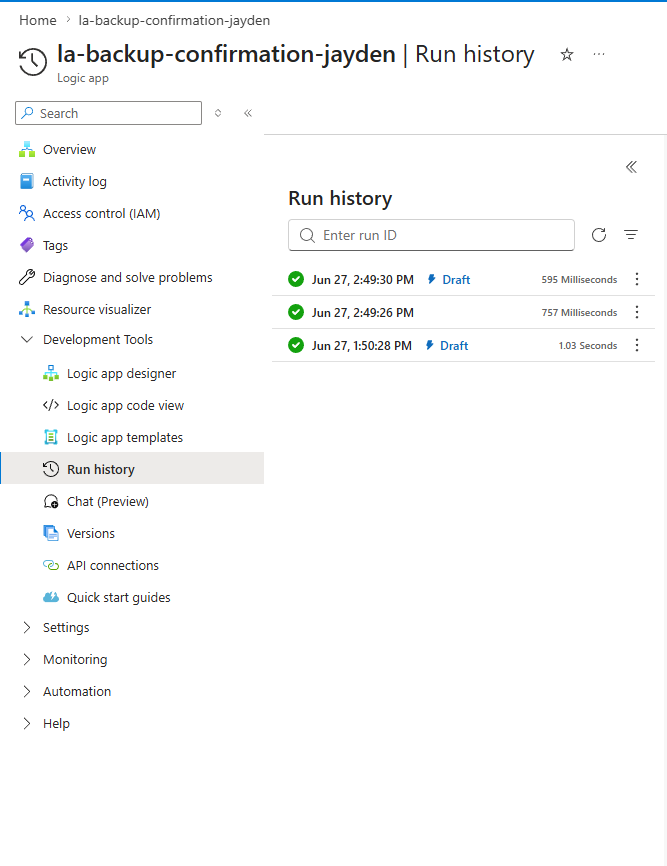
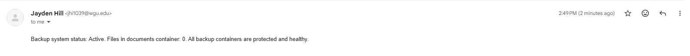
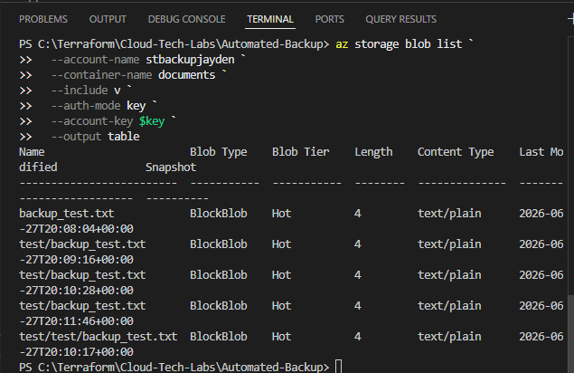
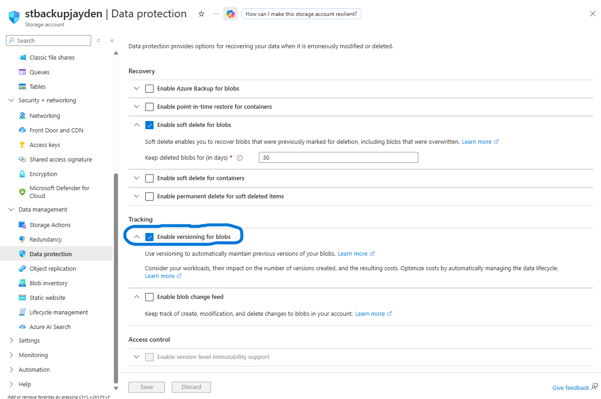
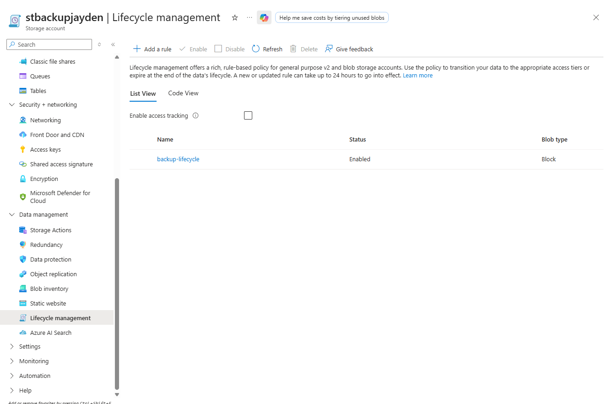
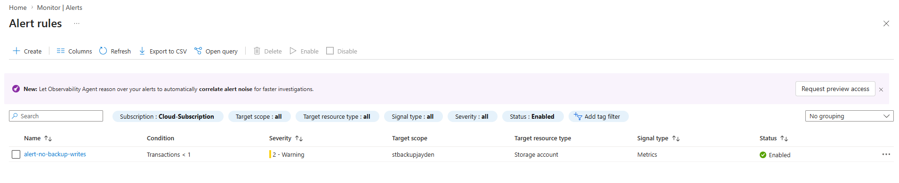

# Automated Backup System on Azure (Terraform + Logic Apps)

Infrastructure-as-Code project that replaces a manual "someone copies files to an external drive" backup process with a fully automated, geo-redundant, self-monitoring backup system on Azure — provisioned entirely with Terraform.


[.jpg)](https://www.loom.com/share/1076f71f22e3486ab2f0b148625e3044)

---

## Table of Contents

- [Business Problem](#business-problem)
- [Architecture](#architecture)
- [What Gets Built](#what-gets-built)
- [Tech Stack](#tech-stack)
- [Prerequisites](#prerequisites)
- [Deployment Walkthrough](#deployment-walkthrough)
  - [1. Define variables](#step-1--define-variables)
  - [2. Set environment-specific values](#step-2--set-environment-specific-values)
  - [3. Build the infrastructure](#step-3--build-the-infrastructure)
  - [4. Define outputs](#step-4--define-outputs)
  - [5. Deploy](#step-5--deploy)
  - [6. Configure the daily confirmation Logic App](#step-6--configure-the-daily-confirmation-logic-app)
  - [7. Test backup versioning end-to-end](#step-7--test-backup-versioning-end-to-end)
- [Verification Checklist](#verification-checklist)
- [Troubleshooting](#troubleshooting)
- [Cost Considerations](#cost-considerations)
- [Cleanup](#cleanup)
- [Skills Demonstrated](#skills-demonstrated)
- [Screenshot Reference Guide](#screenshot-reference-guide)

---

## Business Problem

For most small businesses, the backup strategy is someone occasionally copying files to an external drive. When that person is on vacation, busy, or simply forgets, nothing gets backed up — and when something eventually goes wrong, the data is gone.

This project replaces that manual, unreliable process with a system that:

- **Automatically replicates** every file across multiple Azure data centers the moment it's uploaded
- **Keeps every previous version** of every file, so anything accidentally deleted or overwritten can be restored
- **Automatically moves older files to cheaper storage tiers** after 30 days and archives them after 90 days — controlling cost without manual intervention
- **Sends a daily confirmation email** so the business owner knows the backup system is working without having to check

The result: no more lost data, no more manual processes, no more hoping someone remembered.

## Architecture



**Data flow:**
1. Files land in one of three private Blob containers (`documents`, `database-exports`, `application-files`) in a GRS-replicated storage account.
2. Every write is versioned and soft-deleted on overwrite — nothing is ever silently lost.
3. A lifecycle policy ages data from Hot → Cool (30 days) → Archive (90 days) → Delete (365 days) without any manual intervention.
4. Storage diagnostic settings stream read/write/delete logs and transaction metrics into a Log Analytics workspace.
5. A Monitor alert rule watches the `Transactions` metric and fires through an Action Group if zero write operations occur in a 24-hour window — meaning something upstream has stopped backing up.
6. A Logic App runs every morning at 8:00 AM, lists the blobs in the `documents` container, and emails the business owner a daily confirmation.

## What Gets Built

```
rg-backup-[yourname]
├── Storage Account (primary backup store)
│   ├── Container: documents
│   ├── Container: database-exports
│   ├── Container: application-files
│   ├── Blob Versioning (enabled)
│   └── Lifecycle Policy (30d cool → 90d archive → 365d delete)
├── Log Analytics Workspace
├── Storage Diagnostic Settings      → logs to Log Analytics
├── Action Group                     → email receiver
├── Logic App Workflow               → daily backup confirmation email
└── Monitor Alert Rule               → fires if storage writes stop
```

**11 resources** are provisioned end-to-end via Terraform.

## Tech Stack

| Category | Tools / Services |
|---|---|
| IaC | Terraform (`hashicorp/azurerm` ~> 3.0) |
| Storage | Azure Blob Storage (GRS, versioning, lifecycle management) |
| Automation | Azure Logic Apps |
| Observability | Azure Monitor, Log Analytics Workspace |
| Alerting | Azure Monitor Metric Alerts, Action Groups |
| CLI | Azure CLI |

## Prerequisites

- An active Azure subscription
- Terraform and Azure CLI installed (skip this section if already installed from a previous project)

**macOS:**
```bash
# Homebrew (if needed)
/bin/bash -c "$(curl -fsSL https://raw.githubusercontent.com/Homebrew/install/HEAD/install.sh)"

# Terraform
brew tap hashicorp/tap && brew install hashicorp/tap/terraform
terraform --version

# Azure CLI
brew install azure-cli
az login
az account set --subscription "Azure subscription 1"
```

**Windows (PowerShell):**

Download [Terraform](https://developer.hashicorp.com/terraform/install) and the [Azure CLI](https://aka.ms/installazurecliwindows), then:

```powershell
[Environment]::SetEnvironmentVariable("PATH", $env:PATH + ";C:\terraform", "User")
az login
az account set --subscription "Azure subscription 1"
```

## Deployment Walkthrough

### Step 1 — Define variables

`variables.tf` declares the inputs the configuration needs: your name (used to make resource names globally unique), the deployment region, the alert email address, and a shared tag map applied to every resource.

```hcl
variable "yourname" {
  description = "Your name, lowercase, no spaces. Used to make resource names unique."
  type        = string
}

variable "location" {
  type    = string
  default = "East US"
}

variable "alert_email" {
  description = "Email address to receive daily backup confirmation."
  type        = string
}

variable "tags" {
  type = map(string)
  default = {
    project     = "backup-system"
    environment = "dev"
    managed_by  = "terraform"
  }
}
```

### Step 2 — Set environment-specific values

`terraform.tfvars` supplies the actual values for this deployment:

```hcl
yourname    = "yourname"
location    = "East US"
alert_email = "your.email@example.com"
```

### Step 3 — Build the infrastructure

**Provider configuration:**

```hcl
terraform {
  required_providers {
    azurerm = {
      source  = "hashicorp/azurerm"
      version = "~> 3.0"
    }
  }
}

provider "azurerm" {
  features {}
}

data "azurerm_client_config" "current" {}
```

**Resource group:**

```hcl
resource "azurerm_resource_group" "main" {
  name     = "rg-backup-${var.yourname}"
  location = var.location
  tags     = var.tags
}
```

**Storage account — the core of the backup system.**

Every file uploaded here is automatically replicated across multiple physically separate Azure data centers, not just different rooms in the same building.

- `account_replication_type = "GRS"` — **G**eo-**R**edundant **S**torage. Azure keeps data in the primary region (East US) and asynchronously copies it to a secondary region (West US). If an entire region goes offline, the data still exists in the secondary. GRS is the right choice for a backup system — LRS only replicates within a single region.
- `min_tls_version = "TLS1_2"` — enforces TLS 1.2+ for every connection. Older TLS versions have known vulnerabilities and shouldn't be used for backup data.
- `blob_properties { versioning_enabled = true }` — what actually makes this a backup system rather than a plain file store. Every overwrite or delete keeps the previous version, so a file accidentally overwritten or deleted can be restored to any point in time.
- `delete_retention_policy { days = 30 }` — even after a blob is deleted, Azure soft-deletes it for 30 days before permanently removing it. A safety net layered on top of versioning.

```hcl
resource "azurerm_storage_account" "backup" {
  name                     = "stbackup${var.yourname}"
  resource_group_name      = azurerm_resource_group.main.name
  location                 = var.location
  account_tier             = "Standard"
  account_replication_type = "GRS"
  min_tls_version          = "TLS1_2"

  blob_properties {
    versioning_enabled = true

    delete_retention_policy {
      days = 30
    }

    container_delete_retention_policy {
      days = 30
    }
  }

  tags = var.tags
}
```

**Storage containers.**

Containers are the top-level organizational unit inside a storage account, similar to folders at the root level. Separating data by type matters enormously when restoring something under pressure — you don't want to be searching through a mixed pile of files mid-incident.

`container_access_type = "private"` means no public internet access; files can only be reached by authenticated Azure identities or connection strings. Backup data should never be publicly readable.

```hcl
resource "azurerm_storage_container" "documents" {
  name                  = "documents"
  storage_account_name  = azurerm_storage_account.backup.name
  container_access_type = "private"
}

resource "azurerm_storage_container" "database_exports" {
  name                  = "database-exports"
  storage_account_name  = azurerm_storage_account.backup.name
  container_access_type = "private"
}

resource "azurerm_storage_container" "application_files" {
  name                  = "application-files"
  storage_account_name  = azurerm_storage_account.backup.name
  container_access_type = "private"
}
```

**Lifecycle management policy** — keeps backup costs from growing unbounded.

Azure has four storage tiers — Hot, Cool, Cold, and Archive — each progressively cheaper to store but more expensive to read. Hot suits frequently accessed data; Cool suits occasional access; Archive suits data that's almost never read but must be retained for compliance or recovery.

- The `base_blob` rule applies to the current, live version of each file: Hot → Cool after 30 days of no modification, Cool → Archive after 90 days, and deleted entirely after 365 days.
- The `version` rule applies to superseded versions: kept for 30 days (long enough to catch corruption or accidental deletion), then permanently removed — otherwise old versions would grow storage costs without limit.
- `prefix_match` scopes the policy to all three containers.

```hcl
resource "azurerm_storage_management_policy" "lifecycle" {
  storage_account_id = azurerm_storage_account.backup.id

  rule {
    name    = "backup-lifecycle"
    enabled = true

    filters {
      blob_types   = ["blockBlob"]
      prefix_match = ["documents/", "database-exports/", "application-files/"]
    }

    actions {
      base_blob {
        tier_to_cool_after_days_since_modification_greater_than    = 30
        tier_to_archive_after_days_since_modification_greater_than = 90
        delete_after_days_since_modification_greater_than          = 365
      }

      version {
        delete_after_days_since_creation = 30
      }
    }
  }
}
```

**Log Analytics workspace:**

```hcl
resource "azurerm_log_analytics_workspace" "main" {
  name                = "law-backup-${var.yourname}"
  location            = var.location
  resource_group_name = azurerm_resource_group.main.name
  sku                 = "PerGB2018"
  retention_in_days   = 30
  tags                = var.tags
}
```

**Storage diagnostic settings.**

Routes storage account logs and metrics into Log Analytics. `StorageWrite` records every file write — the signal that backups are landing. `StorageRead` and `StorageDelete` record reads and deletions. Together they give a complete audit trail of everything that's happened to the backup data. The `Transaction` metric makes it possible to alert on unusual patterns like a sudden drop in write activity.

```hcl
resource "azurerm_monitor_diagnostic_setting" "storage_logs" {
  name                       = "diag-storage-to-law"
  target_resource_id         = "${azurerm_storage_account.backup.id}/blobServices/default"
  log_analytics_workspace_id = azurerm_log_analytics_workspace.main.id

  enabled_log { category = "StorageRead" }
  enabled_log { category = "StorageWrite" }
  enabled_log { category = "StorageDelete" }

  metric {
    category = "Transaction"
    enabled  = true
  }
}
```

**Action Group and Logic App** for the daily confirmation.

The Action Group defines where notifications go. The Logic App is what actually sends the confirmation email each morning — it's provisioned here in Terraform and configured visually in the portal in [Step 6](#step-6--configure-the-daily-confirmation-logic-app).

```hcl
resource "azurerm_monitor_action_group" "backup_alerts" {
  name                = "ag-backup-${var.yourname}"
  resource_group_name = azurerm_resource_group.main.name
  short_name          = "backupalert"

  email_receiver {
    name                    = "owner-email"
    email_address           = var.alert_email
    use_common_alert_schema = true
  }

  tags = var.tags
}

resource "azurerm_logic_app_workflow" "backup_confirmation" {
  name                = "la-backup-confirm-${var.yourname}"
  location            = var.location
  resource_group_name = azurerm_resource_group.main.name
  tags                = var.tags
}
```

**Monitor alert — detect if backups stop.**

Fires if the storage account receives zero write transactions in a 24-hour window — if nothing is being written to backup storage, something upstream has broken and the business owner should know.

- `metric_name = "Transactions"` with `operator = "LessThan"` and `threshold = 1` → fires when transaction count drops below 1, i.e. zero transactions.
- `frequency = "PT1H"` → Azure checks the condition every hour. `window_size = "P1D"` → each check looks back over the past 24 hours.
- The `dimension` filter on `ApiName` (`PutBlob`, `PutBlock`) restricts the count to write operations only — without it, the alert would fire during any quiet period, including normal stretches when nobody happens to be reading files.

```hcl
resource "azurerm_monitor_metric_alert" "no_writes" {
  name                = "alert-no-backup-writes"
  resource_group_name = azurerm_resource_group.main.name
  scopes              = [azurerm_storage_account.backup.id]
  description         = "Fires if no files have been written to backup storage in 24 hours."
  severity            = 2
  frequency           = "PT1H"
  window_size         = "P1D"

  criteria {
    metric_namespace = "Microsoft.Storage/storageAccounts"
    metric_name      = "Transactions"
    aggregation      = "Total"
    operator         = "LessThan"
    threshold        = 1

    dimension {
      name     = "ApiName"
      operator = "Include"
      values   = ["PutBlob", "PutBlock"]
    }
  }

  action {
    action_group_id = azurerm_monitor_action_group.backup_alerts.id
  }

  tags = var.tags
}
```

### Step 4 — Define outputs

```hcl
output "storage_account_name" {
  value = azurerm_storage_account.backup.name
}

output "storage_account_connection_string" {
  value     = azurerm_storage_account.backup.primary_connection_string
  sensitive = true
}

output "log_analytics_workspace_id" {
  value = azurerm_log_analytics_workspace.main.id
}

output "logic_app_endpoint" {
  value = azurerm_logic_app_workflow.backup_confirmation.access_endpoint
}
```

`sensitive = true` on the connection string keeps Terraform from printing it in plain text in the terminal. To view it when needed:

```bash
terraform output -raw storage_account_connection_string
```

### Step 5 — Deploy

```bash
terraform init
terraform plan
terraform apply
```

Expect **11 resources to add**. Deployment takes 2–3 minutes.


>

### Step 6 — Configure the daily confirmation Logic App

This part is done in the Azure Portal since the Logic App's *workflow definition* (its trigger and steps) is configured visually rather than in Terraform in this project.

1. In the portal, navigate to `la-backup-confirm-[yourname]`
2. Click **Logic app designer**
3. **Add a trigger** → search **Recurrence** → select **Recurrence**
4. Set **Frequency** to `Day`, **Interval** to `1`, **At these hours** to `8` (8:00 AM)
5. **+ New step** → search **Azure Blob Storage** → select **List blobs**
6. When creating the connection, set **Authentication Type** to **Access Key** (not "Service principal authentication" — that requires an Azure AD app registration and RBAC role assignment this project doesn't set up). Paste in just the raw access key (see the callout below for exactly how to get it), not the full connection string.
7. Set the container to `documents`
8. **+ New step** → **Office 365 Outlook** → **Send an email (V2)**
9. Fill in the email:
   - **To:** your alert email
   - **Subject:** `Daily Backup Confirmation — @{formatDateTime(utcNow(), 'yyyy-MM-dd')}` — type the plain text portion, then insert `formatDateTime(utcNow(), 'yyyy-MM-dd')` as an **Expression** via the dynamic content picker (⚡ icon)
   - **Body:** `Backup system status: Active. Files in documents container: @{length(body('List_blobs')?['value'])}. All backup containers are protected and healthy.` — same approach: type the plain text, then insert `length(body('List_blobs')?['value'])` as an expression
10. Click **Save**

> ⚠️ **Common pitfall — connection authentication.** The Access Key field wants the **raw key only** (a base64 string, no `https://`, no `AccountName=`, no `.net` anywhere in it) — not the full connection string. Get just the key with:
> ```powershell
> az storage account keys list --account-name stbackup[yourname] --resource-group rg-backup-[yourname] --query "[0].value" -o tsv
> ```
>
> ⚠️ **Common pitfall — "Workflow validation failed... action(s) 'List_blobs' ... not defined."** This happens when the List Blobs action's internal name doesn't match what the email step's expression references — usually because the connector got removed/re-added at some point and Logic Apps appended a suffix (e.g. `List_blobs_2`, or the V2 connector's actual name differs from plain `List_blobs`). Click the List Blobs card and check its exact title; either rename it back to `List blobs`, or re-insert the expression using the **dynamic content picker** instead of typing it by hand so the reference can't drift out of sync.


>

>

### Step 7 — Test backup versioning end-to-end

Upload a test file:

**macOS:**
```bash
echo "Backup test file created $(date)" > /tmp/backup_test.txt

az storage blob upload \
  --account-name stbackup[yourname] \
  --container-name documents \
  --name test/backup_test.txt \
  --file /tmp/backup_test.txt \
  --auth-mode login
```

**Windows (PowerShell):**
```powershell
"Backup test file created $(Get-Date)" | Out-File -FilePath "$env:TEMP\backup_test.txt" -Encoding utf8

az storage blob upload `
  --account-name stbackup[yourname] `
  --container-name documents `
  --name test/backup_test.txt `
  --file "$env:TEMP\backup_test.txt" `
  --auth-mode login
```

> ⚠️ **If this throws "You do not have the required permissions needed to perform this operation":** `--auth-mode login` uses your own Azure AD identity, but creating the storage account with Terraform doesn't automatically grant *your* account data-plane access to it — owning the subscription isn't the same as having blob data permissions. Either:
> - **Grant yourself the RBAC role** (takes a few minutes to propagate):
>   ```powershell
>   $objectId = az ad signed-in-user show --query id -o tsv
>   az role assignment create --assignee $objectId --role "Storage Blob Data Contributor" --scope "/subscriptions/<sub-id>/resourceGroups/rg-backup-[yourname]/providers/Microsoft.Storage/storageAccounts/stbackup[yourname]"
>   ```
> - **Or swap to key-based auth for testing**, replacing `--auth-mode login` with `--auth-mode key --account-key <your-key>` (pulled the same way as in Step 6)
> - **Or just do this step in the portal** — Storage account → Containers → `documents` → Upload, with "Upload to folder" set to `test/`

Overwrite the file to create a second version:

**macOS:**
```bash
echo "Updated content — second version $(date)" > /tmp/backup_test.txt

az storage blob upload \
  --account-name stbackup[yourname] \
  --container-name documents \
  --name test/backup_test.txt \
  --file /tmp/backup_test.txt \
  --auth-mode login \
  --overwrite
```

**Windows (PowerShell):**
```powershell
"Updated content — second version $(Get-Date)" | Out-File -FilePath "$env:TEMP\backup_test.txt" -Encoding utf8

az storage blob upload `
  --account-name stbackup[yourname] `
  --container-name documents `
  --name test/backup_test.txt `
  --file "$env:TEMP\backup_test.txt" `
  --auth-mode login `
  --overwrite
```

List versions to confirm both exist:

```bash
az storage blob list \
  --account-name stbackup[yourname] \
  --container-name documents \
  --include v \
  --auth-mode login \
  --output table
```

You should see **two rows** for `test/backup_test.txt` — the current version and one previous version, confirming versioning is working.



## Verification Checklist

- [ ] Storage account `stbackup[yourname]` exists in the portal
- [ ] Storage account → Data management → Versioning shows **Enabled**
- [ ] Storage account → Data management → Lifecycle management shows the `backup-lifecycle` rule
- [ ] Three containers exist: `documents`, `database-exports`, `application-files`
- [ ] Logic App `la-backup-confirm-[yourname]` runs on a recurrence trigger
- [ ] Alert rule `alert-no-backup-writes` exists in Monitor → Alerts
- [ ] Test file upload produced two versions in the blob list output


>

>

## Troubleshooting

| Error | Cause | Resolution |
|---|---|---|
| `StorageErrorCode: BlobAccessTierNotSupported` | Archive tier not available for GRS accounts in some regions | Change `tier_to_archive_after_days` to a longer value or remove the archive rule |
| Logic App blob connection fails | Connection string not entered correctly | Run `terraform output -raw storage_account_connection_string` and paste the full string |
| `Failed to create connection: ... "Storage Account Access Key should be a correct base64 encoded string"` | Pasted the full connection string (or a string with `.net`/`AccountName=` in it) into the Access Key field instead of just the raw key | Use `az storage account keys list --account-name <name> --resource-group <rg> --query "[0].value" -o tsv` and paste only that output |
| `Workflow validation failed: The action(s) 'List_blobs' referenced by 'inputs' in action 'Send_an_email_(V2)' are not defined` | The List Blobs action's internal name doesn't match what the email step's expression references (often after re-adding the connector) | Rename the List Blobs action back to `List blobs`, or re-insert the expression via the dynamic content picker instead of typing the name manually |
| `az storage blob upload` fails with "You do not have the required permissions" using `--auth-mode login` | Your Azure AD identity has no data-plane RBAC role on the storage account, even though you created it | Assign yourself `Storage Blob Data Contributor` on the storage account scope, or use `--auth-mode key` instead |
| `git push` rejected: `File .terraform/providers/.../terraform-provider-azurerm_....exe is 227.63 MB; this exceeds GitHub's file size limit` | `.terraform/` (downloaded provider binaries) got committed because no `.gitignore` was in place before the first commit | Add a `.gitignore` that excludes `.terraform/`, `*.tfstate`, and `terraform.tfvars` *before* your first commit; if the large file is already in history, either start a fresh `git init` (safe if nothing has been pushed successfully yet) or use `git filter-repo --path .terraform --invert-paths` to strip it from past commits |
| Alert fires immediately | No write activity yet | Upload a file using the test steps above; the alert uses a 24-hour window |
| Two versions not visible in portal | Portal sometimes hides versions by default | In the container view, click the **Show versions** toggle |

## Cost Considerations

- **GRS storage** roughly doubles the storage cost of LRS in exchange for cross-region durability — appropriate for a backup system, not necessarily for every workload.
- The **lifecycle policy** is the main cost control: data automatically moves to cheaper tiers (Cool, then Archive) as it ages, rather than sitting in Hot storage indefinitely.
- **Log Analytics retention** is capped at 30 days in this configuration to keep ingestion/retention costs predictable.
- Remember to run `terraform destroy` (see [Cleanup](#cleanup)) after testing to avoid ongoing charges for resources you're no longer using.

## Cleanup

```bash
terraform destroy
```

## Skills Demonstrated

- Infrastructure as Code with Terraform (`azurerm` provider)
- Azure Blob Storage architecture: replication strategy (GRS), versioning, soft delete, and container access control
- Cost governance via storage lifecycle management policies
- Observability: diagnostic settings, Log Analytics, and metric-based alerting
- Low-code automation with Azure Logic Apps
- Incident-style alerting design (detecting the *absence* of an expected signal, not just error conditions)
- RBAC vs. key-based authentication tradeoffs across the Azure CLI, Logic Apps connectors, and portal
- Git/IaC repo hygiene (`.gitignore` for provider binaries and state, secrets kept out of version control)
